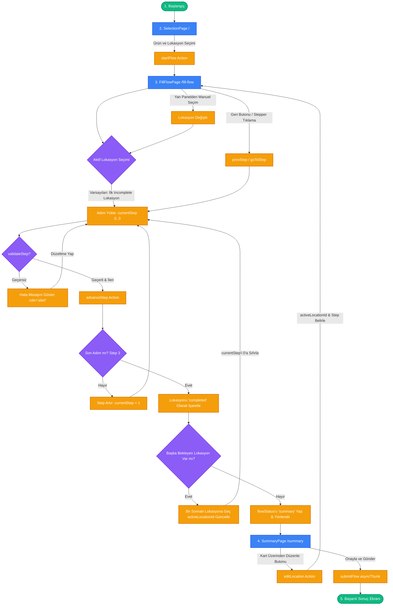

# Stock Fill Flow – Ürün Bazlı Çok Adımlı Stok Dolum Yönetim Sistemi

Sağlık kuruluşları için geliştirilmiş, ürün bazlı, çok lokasyonlu ve çok adımlı stok dolum yönetim uygulaması.

---

## 🚀 Kurulum ve Çalıştırma

Projenin yerel ortamda kurulması ve çalıştırılması için aşağıdaki adımları takip edebilirsiniz:

```bash
# Bağımlılıkları yükle
npm install

# Geliştirme sunucusunu (dev server) başlat
npm run dev
```

Uygulama varsayılan olarak `http://localhost:5173` adresinde çalışacaktır.

### 🧪 Testlerin Çalıştırılması

Projedeki birim (unit) ve bileşen (component) testlerini çalıştırmak için:

```bash
# Testleri tek seferlik çalıştır
npm run test

# Testleri izleme (watch) modunda çalıştır
npm run test:watch

# Test kapsama (coverage) raporunu oluştur
npm run test:coverage
```

### 🧹 Formatlama ve Kod Kalitesi

```bash
# Kod formatını kontrol et ve düzelt (Prettier)
npm run format

# Statik kod analizini çalıştır (ESLint)
npm run lint
```

---

## 🛠️ Teknoloji Tercihleri

| Teknoloji         | Sürüm |
| :---------------- | :---- |
| **React**         | 19    |
| **Vite**          | 8     |
| **TypeScript**    | ~6    |
| **Redux Toolkit** | ^2    |
| **React Router**  | ^7    |
| **Tailwind CSS**  | ^4    |
| **Headless UI**   | ^2    |
| **lucide-react**  | ^1    |
| **Vitest**        | ^4    |

---

## 💡 Mimari Yaklaşım

Uygulama; özellik (feature) tabanlı modüler klasör yapısı, yönlendirme (React Router v7) ve merkezi durum yönetimi (Redux Toolkit) kullanılarak yapılandırılmıştır.

- **Redux Toolkit:** Context API'ye göre ölçeklenmeye (scalability) ve performans optimizasyonlarına daha açık olduğu için tercih edilmiştir.
- **React Router v7:** Çok adımlı akış geçişlerini URL segmentleri üzerinden takip etmek ve tarayıcı geçmişini yönetmek için kullanılmıştır.

---

## 🔄 Akış Modellemesi (State & Flow Architecture)

Uygulamanın durumu ve akışı; kullanıcı adımları, lokasyon döngüsü ve geri dönüş senaryolarını kapsayacak şekilde modellenmiştir.

### Akış Diyagramı (Flow Diagram)



### Akış Yaklaşımı ve Gerekçeleri

1. **Adım Geçişleri (Step Transitions):**
   - Her lokasyonun formu 4 adımdan oluşur:
     - **Adım 0 (Kritik Miktar):** Zorunlu, sayısal girdi (>0).
     - **Adım 1 (Hedef ve Maksimum Kapasite):** Zorunlu, sayısal girdi (>0), Min < Max.
     - **Adım 2 (Dolum Miktarı):** Zorunlu, sayısal girdi, Min ≤ Değer ≤ Max aralığında olmalı.
     - **Adım 3 (Son Kullanma Tarihi):** Zorunlu, tarih seçimi (bugünden/yarından ileri tarih).
   - Kullanıcı "İleri" butonuna tıkladığında [validateStep](file:///C:/Users/oguzh/OneDrive/Masaüstü/stock-fill-flow/src/features/fillFlow/validators.ts) fonksiyonu çalıştırılır. Hata varsa state'teki `errors` nesnesi güncellenir ve ilgili alan `aria-invalid` ile işaretlenerek `role="alert"` içeren hata mesajı gösterilir. Hata yoksa `advanceStep` tetiklenerek bir sonraki adıma geçilir.
   - _Gerekçe:_ Formun küçük parçalara bölünmesi bilişsel yükü (cognitive load) azaltır. Validasyonların adım geçişlerinde anında yapılması ise hatalı veri girişinin sonraki adımlara taşınmasını engeller.

2. **Lokasyonlar Arası Döngü (Inter-Location Loop):**
   - Seçilen lokasyonlar sırayla doldurulur. Bir lokasyonun tüm adımları başarıyla tamamlandığında (`MarkComplete`), sistem bir sonraki tamamlanmamış (incomplete) lokasyonu otomatik olarak aktif hale getirir (`activeLocationId` güncellenir) ve adımı `0` olarak başlatır.
   - Tüm lokasyonlar tamamlandığında kullanıcı otomatik olarak `/summary` sayfasına yönlendirilir.
   - _Gerekçe:_ Kullanıcının her lokasyon sonrasında yeni lokasyonu manuel seçme ihtiyacını ortadan kaldırarak operasyonel hızı artırır.

3. **Geri Dönüş ve Düzeltme Senaryoları (Fallback/Return Scenarios):**
   - **Adımlar Arası Geri Dönüş:** Kullanıcı aktif lokasyon içinde "Geri" butonu ile bir önceki adıma dönebilir veya `stepper` üzerindeki daha önce tamamlanmış adım dairelerine tıklayarak doğrudan o adıma geçiş yapabilir (`goToStep` action).
   - **Lokasyonlar Arası Manuel Geçiş:** Kullanıcı soldaki lokasyon listesi (sidebar) üzerinden istediği lokasyona tıklayarak dilediği an o lokasyona geçiş yapabilir. Girdiği veriler Redux state'inde saklandığı için hiçbir veri kaybı yaşanmaz.
   - **Özet Sayfasından Düzenleme:** `/summary` sayfasında kullanıcı tüm lokasyonların özet kartlarını görür. Herhangi bir lokasyonun verisini düzenlemek istediğinde, o lokasyon kartındaki "Düzenle" butonuna tıklar. Bu işlem `editLocation` aksiyonunu tetikler; aksiyon ilgili lokasyonu aktif hale getirir, adımı 0'a (veya düzenlenmek istenen adıma) konumlandırır ve kullanıcıyı `/fill-flow` sayfasına yönlendirir.
   - _Gerekçe:_ Kullanıcıya esneklik ve kontrol sağlanmıştır. Merkezi Redux deposu sayesinde sayfa ve lokasyon geçişlerinde veri kaybı yaşanmaz.

---

## 🏷️ Geliştirme Standartları ve İsimlendirme Konvansiyonları

Bileşen, dosya ve klasör isimlendirmesinde tutarlılığı sağlamak amacıyla aşağıdaki kurallar benimsenmiştir:

### Dosya Adlandırma Yaklaşımı

| Dosya Türü                            | Standart                      | Örnek                                    |
| :------------------------------------ | :---------------------------- | :--------------------------------------- |
| **Bileşenler (Components)**           | `camelCase.tsx`               | `button.tsx`, `numericField.tsx`         |
| **Sayfa Bileşenleri (Pages)**         | `camelCase.tsx`               | `selectionPage.tsx`, `fillFlowPage.tsx`  |
| **Özel Hook'lar (Hooks)**             | `camelCase.ts` (`use` ön eki) | `useAppDispatch.ts`, `useAppSelector.ts` |
| **Yardımcı Dosyalar (Utils/Helpers)** | `camelCase.ts`                | `validators.ts`, `fakeApi.ts`            |
| **Redux Slices**                      | `camelCase + Slice.ts`        | `fillFlowSlice.ts`                       |
| **Sabitler (Constants)**              | `camelCase.ts`                | `selectionPage.ts`, `button.ts`          |
| **Klasörler (Folders)**               | `camelCase`                   | `locationList/`, `stepper/`, `fillFlow/` |

### Klasör Yapısı ve Katmanlar

```
src/
├── app/                          # Uygulama çekirdek katmanı
│   ├── store.ts                  # Redux store yapılandırması
│   ├── hooks.ts                  # Redux dispatch/selector tipleri
│   └── router.tsx                # React Router v7 rota tanımları
│
├── features/                     # İş mantığının (business logic) kapsüllendiği modüller
│   └── fillFlow/                 # Dolum akışı durum ve iş mantığı
│       ├── __tests__/            # Thunk ve Slice testleri
│       ├── constants.ts          # Dolum adımları ve mock veri tanımları
│       ├── fakeApi.ts            # Gecikmeli mock API çağrıları
│       ├── fillFlowSlice.ts      # Redux Toolkit slice
│       ├── selectors.ts          # Memoized Redux selector'ları
│       ├── types.ts              # TypeScript arayüz ve tipleri
│       └── validators.ts         # Çok adımlı formun validasyon mantığı
│
├── components/                   # Yeniden kullanılabilir genel arayüz elemanları
│   ├── locationList/             # Lokasyon listesi sidebar bileşeni
│   │   ├── __tests__/            # Lokasyon listesi testleri
│   │   └── locationList.tsx      # Lokasyon listesi bileşeni
│   ├── stepper/                  # Adım göstergesi stepper bileşenleri
│   │   ├── stepIndicator.tsx     # Tekil adım dairesi göstergesi
│   │   └── stepper.tsx           # Stepper kapsayıcısı
│   └── ui/                       # Atomik UI bileşenleri
│       ├── __tests__/            # UI bileşen testleri
│       ├── button.tsx            # Çok amaçlı buton bileşeni
│       ├── input.tsx             # Headless UI uyumlu input bileşeni
│       ├── layout.tsx            # Uygulama ana yerleşimi (Header, Sidebar ve İçerik)
│       └── fields/               # Form girdi alanları
│           ├── dateField.tsx     # Tarih girişi bileşeni
│           └── numericField.tsx  # Sayısal giriş bileşeni
│
├── pages/                        # Rotalarla eşleşen ana sayfa bileşenleri
│   ├── fillFlow/                 # Dolum akış sayfa alt-parçaları
│   │   ├── rangeIndicator.tsx    # Min/max kapasite göstergesi
│   │   └── stepContent.tsx       # Aktif adıma göre formu render eden bileşen
│   ├── selection/                # Ürün ve lokasyon seçim sayfa alt-parçaları
│   │   └── productPanel.tsx      # Ürün seçim paneli
│   ├── summary/                  # Özet sayfa alt-parçaları
│   │   └── locationSummaryCard.tsx # Lokasyon özet kartı
│   ├── fillFlowPage.tsx          # Adım-adım dolum akış sayfası
│   ├── selectionPage.tsx         # Ürün ve lokasyon seçme ana sayfası
│   └── summaryPage.tsx           # Özet ve onay sayfası
│
├── constants/                    # Bileşen ve sayfalar için metinsel/konfigürasyon sabitleri
│   ├── button.ts
│   ├── dateField.ts
│   ├── locationList.ts
│   ├── selectionPage.ts
│   └── summaryPage.ts
│
├── test/                         # Test kurulumu ve yardımcıları
│   └── setup.ts                  # Vitest test ortam hazırlığı
│
├── App.tsx                       # Router ve Redux Provider sarmalayıcısı
├── index.css                     # Tailwind v4 + global stiller + design tokens
└── main.tsx                      # Uygulama giriş noktası (Mounting)
```

#### İlgili Dosya Linkleri:

- **Çekirdek:** [store.ts](file:///C:/Users/oguzh/OneDrive/Masaüstü/stock-fill-flow/src/app/store.ts) | [hooks.ts](file:///C:/Users/oguzh/OneDrive/Masaüstü/stock-fill-flow/src/app/hooks.ts) | [router.tsx](file:///C:/Users/oguzh/OneDrive/Masaüstü/stock-fill-flow/src/app/router.tsx)
- **Özellik (Feature):** [fillFlowSlice.ts](file:///C:/Users/oguzh/OneDrive/Masaüstü/stock-fill-flow/src/features/fillFlow/fillFlowSlice.ts) | [selectors.ts](file:///C:/Users/oguzh/OneDrive/Masaüstü/stock-fill-flow/src/features/fillFlow/selectors.ts) | [validators.ts](file:///C:/Users/oguzh/OneDrive/Masaüstü/stock-fill-flow/src/features/fillFlow/validators.ts) | [types.ts](file:///C:/Users/oguzh/OneDrive/Masaüstü/stock-fill-flow/src/features/fillFlow/types.ts)
- **Sayfalar:** [selectionPage.tsx](file:///C:/Users/oguzh/OneDrive/Masaüstü/stock-fill-flow/src/pages/selectionPage.tsx) | [fillFlowPage.tsx](file:///C:/Users/oguzh/OneDrive/Masaüstü/stock-fill-flow/src/pages/fillFlowPage.tsx) | [summaryPage.tsx](file:///C:/Users/oguzh/OneDrive/Masaüstü/stock-fill-flow/src/pages/summaryPage.tsx)
- **Ortak Bileşenler:** [layout.tsx](file:///C:/Users/oguzh/OneDrive/Masaüstü/stock-fill-flow/src/components/ui/layout.tsx) | [button.tsx](file:///C:/Users/oguzh/OneDrive/Masaüstü/stock-fill-flow/src/components/ui/button.tsx) | [input.tsx](file:///C:/Users/oguzh/OneDrive/Masaüstü/stock-fill-flow/src/components/ui/input.tsx)

### State Yönetimi Organizasyonu

- **Normalize Edilmiş State:** Lokasyonlar bir dizi yerine `Record<string, Location>` (ID -> Lokasyon) yapısında normalize edilmiştir. Seçili lokasyonların sırası ise `selectedLocationIds: string[]` dizisinde saklanır.
- **Selector Yapısı:** [selectors.ts](file:///C:/Users/oguzh/OneDrive/Masaüstü/stock-fill-flow/src/features/fillFlow/selectors.ts) içinde toplanan memoized selector'lar (`createSelector`), bileşenlerin sadece bağımlı oldukları state dilimleri değiştiğinde render edilmesini garanti eder.

### Stil Yaklaşımı

- **Teknoloji:** **Tailwind CSS v4** ve Vite entegrasyonu (`@tailwindcss/vite`) tercih edilmiştir.
- **Tasarım Sistemi:** CSS değişkenleri ve tasarım token'ları (`--color-primary-500`, `--color-success-600` vb.) [index.css](file:///C:/Users/oguzh/OneDrive/Masaüstü/stock-fill-flow/src/index.css) dosyasında `@theme` yönergesi kullanılarak tanımlanmıştır. Harici bir `tailwind.config.js` dosyasına ihtiyaç duyulmaz.
- **Sınıf Adlandırma:** Tailwind utility sınıf listeleri doğrudan JSX öğelerinde kullanılmıştır. Tasarım tutarlılığını sağlamak için ortak arayüz elemanları kendi bileşenlerine (örneğin [button.tsx](file:///C:/Users/oguzh/OneDrive/Masaüstü/stock-fill-flow/src/components/ui/button.tsx)) kapsüllenmiştir.

### Import Yolları ve Modül İhracatı (Barrel)

- **Import Alias:** Göreli yolların getirdiği karmaşıklığı (`../../../components` gibi) önlemek amacıyla `@/` alias yapısı tanımlanmıştır (`@/` doğrudan `src/` klasörünü gösterir).
- **Barrel Dosyası Kullanımı:** Projede `index.ts` veya `index.tsx` gibi barrel dosyaları **bilinçli olarak kullanılmamıştır**.

### Commit Mesajı Formatı

Projede **Conventional Commits** standardı takip edilmektedir:

```
<tip>: <açıklama>

Örnekler:
- feat: add validation for step 2 fill amount
- fix: resolve button focus outline in safari
- docs: update flow diagram and architecture details
```

- **`feat`:** Yeni bir özellik eklendiğinde.
- **`fix`:** Bir hata düzeltildiğinde.
- **`docs`:** Dokümantasyon güncellemelerinde.
- **`style`:** Kodun çalışmasını etkilemeyen görsel değişikliklerde (whitespace, formatting, css vb.).
- **`refactor`:** Ne bir hata düzelten ne de yeni özellik ekleyen kod düzenlemelerinde.
- **`test`:** Test ekleme veya mevcut testleri güncelleme işlemlerinde.
- **`chore`:** Derleme süreci veya yardımcı araçların güncellenmesinde.

---

## ♿ Erişilebilirlik (A11y) Standartları

Uygulama, tüm kullanıcıların kolayca erişebilmesi için WAI-ARIA standartlarına uygun olarak tasarlanmıştır:

- **Odak Yönetimi:** Headless UI kütüphanesi ile arayüz elemanlarının odaklanma (focus) davranışları ve klavye navigasyonları tam uyumlu hale getirilmiştir.
- **Açıklayıcı Nitelikler:** Tüm girdilerde (input) `aria-invalid`, `aria-describedby`, `aria-required` ve ilişkili `<label htmlFor>` etiketleri eksiksiz kullanılmıştır.
- **Dinamik Duyurular:** Adım geçişleri ve hata bildirimleri `role="alert"` veya `aria-live="polite"` özellikleri ile ekran okuyuculara anında bildirilir.

---

## ⏱️ Süre ve Önceliklendirme Notu

- **Hedef Süre:** 5 - 7 saat
- **Gerçekleşen Süre:** ~7 saat

### Kapsam ve Önceliklendirme Stratejisi

Kısıtlı süre içerisinde en yüksek faydayı sağlamak adına projenin kapsamı şu şekilde önceliklendirilmiştir:

1. **Yüksek Öncelik (Tamamlananlar):**
   - Dolum akışı durum makinesinin (state machine) ve geçiş mantığının eksiksiz kurulması.
   - Geri dönüş senaryolarının (adımlar arası geri gitme, lokasyon değiştirme, özetten düzenleme) kusursuz çalışması.
   - Tüm adımlar için iş kurallarına uygun validasyonların yapılması ve hata yönetiminin görselleştirilmesi.
   - Core UI bileşenlerinin (Button, Input, NumericField, DateField) erişilebilirlik standartlarına uygun olarak kodlanması.
   - Thunk ve slice mantığı ile validasyon kurallarını kapsayan **47 adet birim/bileşen testinin** yazılması.
2. **Düşük Öncelik (Süre Kısıtından Dolayı Ertelenenler):**
   - Aşağıdaki maddeler süre sınırı nedeniyle native çözümlerle geçilmiş veya kapsam dışı bırakılmıştır.

---

## 🐛 Bilinen Eksiklikler (Known Issues)

- **State Kalıcılığı (Persistence):** Sayfa yenilendiğinde Redux state sıfırlanmaktadır. `localStorage` veya `sessionStorage` senaryoları entegre edilmemiştir.
- **E2E Test Eksikliği:** Vitest ile birim ve entegrasyon testleri (47 adet) başarıyla koşulmaktadır ancak Cypress veya Playwright gibi araçlarla uçtan uca (End-to-End) kullanıcı akış testleri eklenmemiştir.
